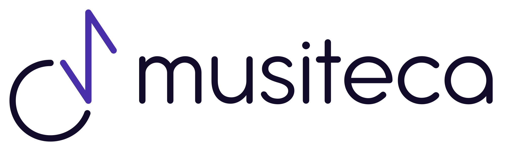
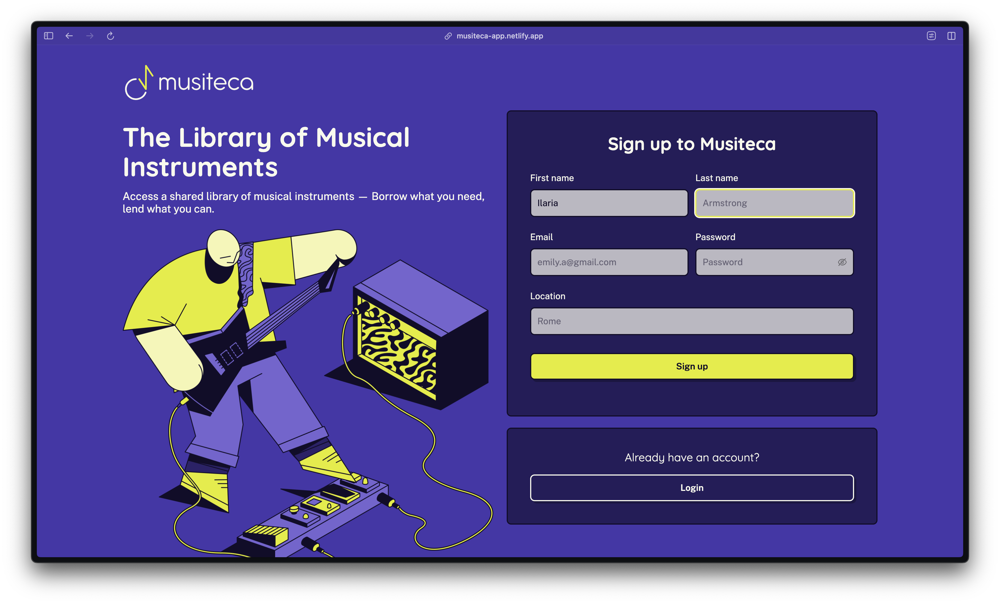
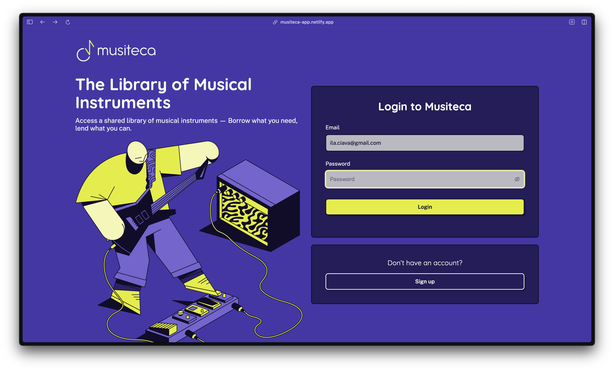
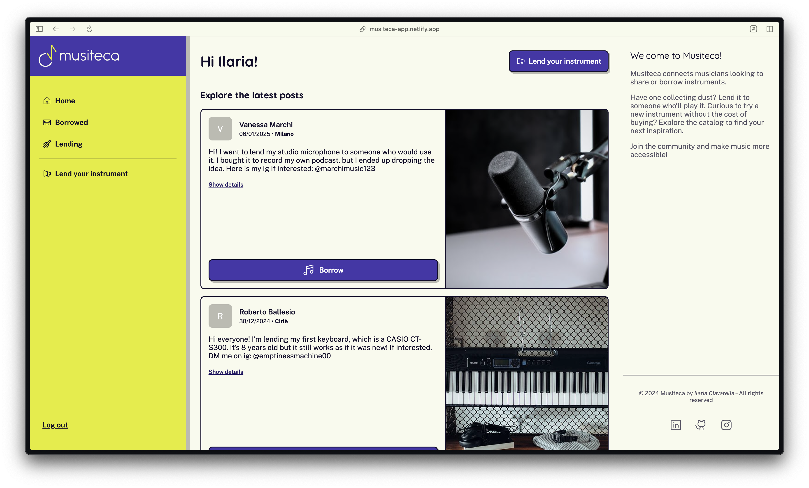
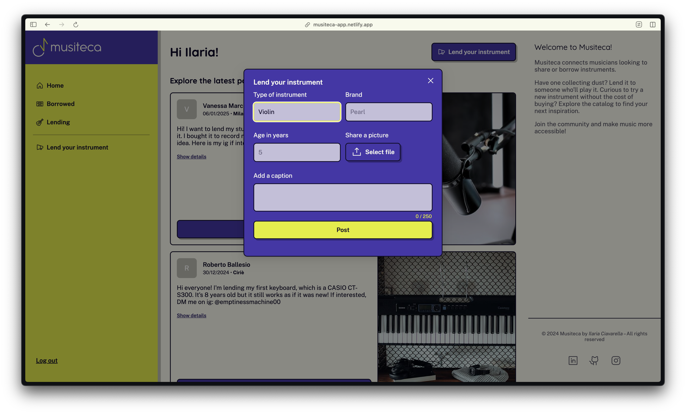
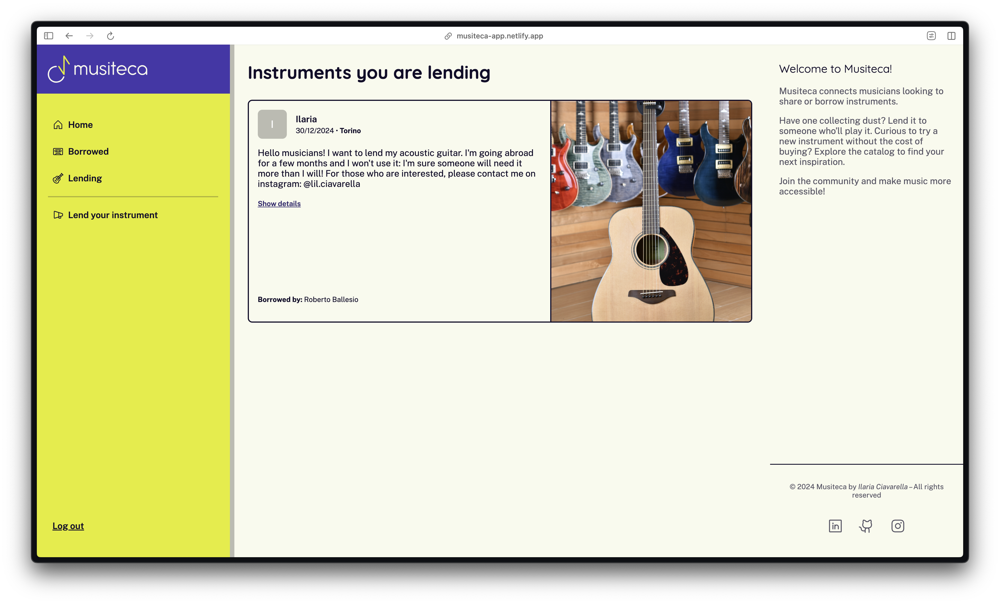
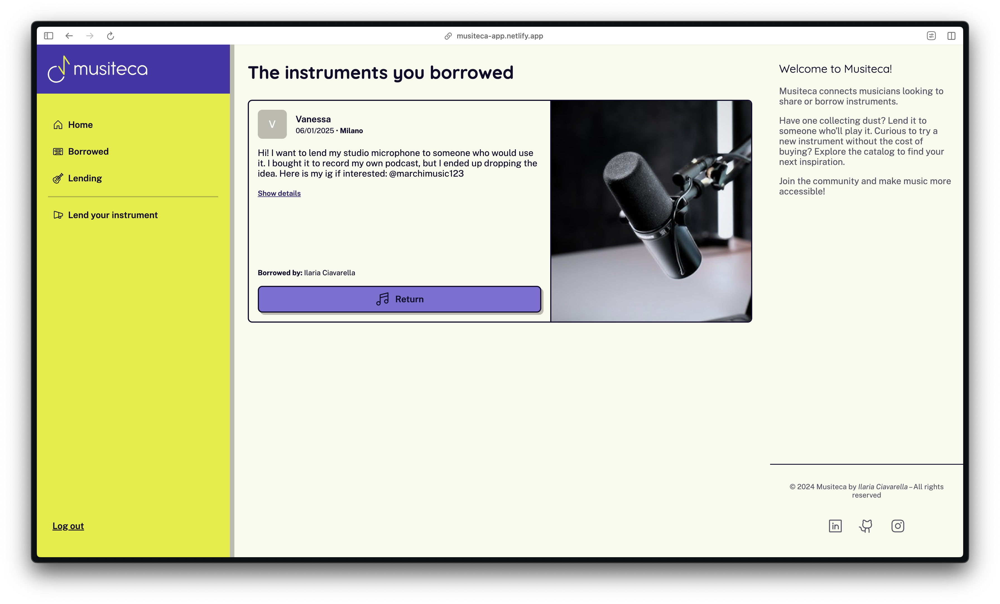

# Musiteca

Welcome to Musiteca - The Library of Musical Instruments!
Borrow or lend instruments within a vibrant community of musicians and make music more accessible.

[![Website][website-shield]][website-url]


## Description

Musiteca is the final project for the Start2Impact Full Stack Development course.

The platform aims to connect musicians looking to share or borrow instruments.
Have one collecting dust? Lend it to someone who’ll play it. Curious to try a new instrument without the cost of buying? Explore the catalog to find your next inspiration.

Sign up and join the community!


## Technologies used

### Front end

- [**React**](https://react.dev/)
   - [**Vite**](https://vite.dev/)
   - [**React Router**](https://reactrouter.com/en/main)
- [**Scss**](https://sass-lang.com/documentation/)
- [**Ant Design**](https://ant.design/)
- [**Axios**](https://axios-http.com/)

### Back end

- [**Java**](https://www.oracle.com/it/java/technologies/downloads/#java21)
   - [**Spring Boot**](https://spring.io/projects/spring-boot)
   - [**Spring Data MongoDB**](https://spring.io/projects/spring-data-mongodb)
- [**MongoDB**](https://www.mongodb.com/)
- [**Firebase Cloud Storage**](https://firebase.google.com/products/storage)


## Usage

Musiteca provides an intuitive flow for users to lend and borrow instruments. Here’s how you can get started:

1. **Register to the platform:**  
   Create an account by filling in your details.

   

2. **Sign in to your account:**  
   Log in using the email and password you registered with.

   

3. **Explore the home page:**  
   Browse through the community’s shared instruments.

   

4. **Lend an instrument:**  
   Share an instrument by filling in the form with its details and photo.

   

5. **View your shared posts:**  
   Track the instruments you've shared in the _Lending_ section.

   

6. **Reserve an instrument:**  
   Interested in borrowing? Click the _Borrow_ button on a post to reserve the instrument.

7. **Manage your borrowed instruments:**  
   Keep track of the instruments you've reserved in the _Borrowed_ section.

   

---


## Contributing

If you'd like to contribute to this project, please follow these steps:

1. Fork the repository on GitHub;
2. Create a new branch with a descriptive name;
3. Make your changes and commit them with clear messages;
4. Push your branch to your forked repository;
5. Submit a pull request to this repository.

### Installation guide

1. Clone the repository to your local machine:

   ```
   git clone https://github.com/ilariaciavarella/musiteca.git
   ```

2. Navigate to the project directory;

3. Install all the necessary dependencies both in the `client/` and in the `server/` folder;

4. Add your `.env` files to both directories. Examples files for both are provided:

   - `client/.env.example`
   - `server/src/main/resources/.env.example`

   Copy the names of the variables and fill in the values.

5. Run the application locally
   - Server
      ```
      cd server
      ./mvnw spring-boot:run
      ```
   
   - Client 
     ```
     cd client
     npm run dev
     ```
     Open the app at `http://localhost:5173`

## Licence
Distributed under the MIT License. See `LICENSE` file for more information.


## Contact

Nice to meet you, I'm Ilaria!

Reach out to me anytime, here are the links:

[![GitHub][github-shield]][github-url]

[![LinkedIn][linkedin-shield]][linkedin-url]

[![Instagram][instagram-shield]][instagram-url]

<!-- LINKS & IMAGES -->

[website-shield]: https://img.shields.io/badge/CLICK_HERE_TO-TRY_IT_OUT!-8222A5?style=for-the-badge&labelColor=E2EE00&color=4930AA
[website-url]: https://musiteca-app.netlify.app/
[github-shield]: https://img.shields.io/badge/GitHub-D91254?style=flat-square&label=See%20my%20work%20on&labelColor=1C1719
[github-url]: https://github.com/ilariaciavarella
[linkedin-shield]: https://img.shields.io/badge/LinkedIn-2FB6B2?style=flat-square&label=Connect%20with%20me%20on&labelColor=1C1719
[linkedin-url]: https://www.linkedin.com/in/ilaria-ciavarella/
[instagram-shield]: https://img.shields.io/badge/Instagram-D91254?style=flat-square&label=Follow%20me%20on&labelColor=1C1719
[instagram-url]: https://www.instagram.com/lil.ciavarella/